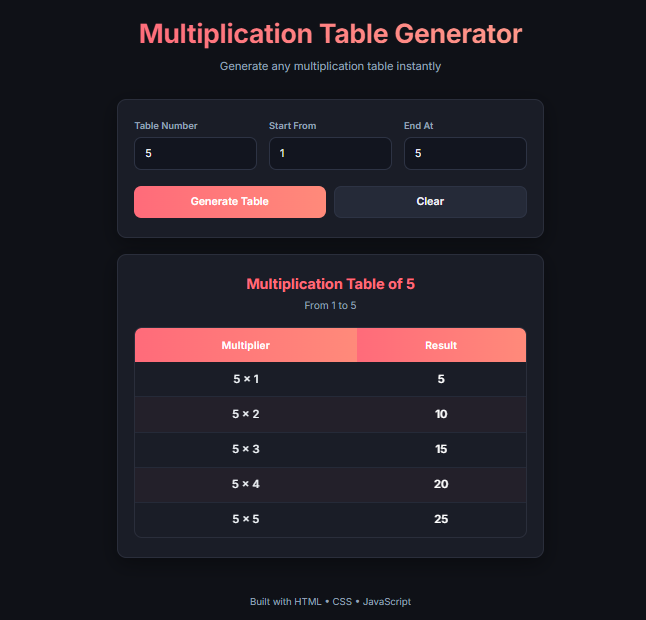

# Multiplication Table Generator

A clean, modern, and fully responsive **Multiplication Table Generator** built with pure **HTML, CSS, and Vanilla JavaScript**.

The application allows users to generate a multiplication table for any non-zero number with a custom starting and ending range.

## Features

* Generate a multiplication table for any number
* Custom starting range
* Custom ending range
* Supports positive and negative values
* Supports ascending and descending ranges
* Prevents invalid non-numeric keyboard input
* Prevents invalid non-numeric paste input
* Prevents table generation when the table number is `0`
* Form validation with user-friendly error messages
* Clear button to reset the form
* Dynamic table generation using JavaScript
* Smooth result scrolling
* Smooth row animations
* Responsive design for mobile, tablet, and desktop
* Modern dark-themed UI
* Clean and portfolio-friendly interface

## Technologies Used

* **HTML5** — Page structure and semantic elements
* **CSS3** — Responsive layout, styling, animations, Flexbox and CSS Grid
* **Vanilla JavaScript** — DOM manipulation, validation, events and dynamic table generation
* **Google Fonts (Inter)** — Modern typography

## Preview



## How to Use

1. Enter the number for which you want to generate the table.
2. Enter the starting value in **Start From**.
3. Enter the ending value in **End At**.
4. Click **Generate Table**.
5. The multiplication table will be generated dynamically.
6. Click **Clear** to reset the application.

### Example

If you enter:

* Table Number: `7`
* Start From: `1`
* End At: `10`

The application will generate:

```text
7 × 1 = 7
7 × 2 = 14
7 × 3 = 21
7 × 4 = 28
7 × 5 = 35
7 × 6 = 42
7 × 7 = 49
7 × 8 = 56
7 × 9 = 63
7 × 10 = 70
```

## Project Structure

```text
Dynamic-Multiplication-Table/
│
├── Index.html
├── Style.css
├── Script.js
├── Preview.png
└── README.md
```

## Project Purpose

This project demonstrates practical use of:

* DOM manipulation
* JavaScript loops
* Event handling
* Form validation
* Dynamic HTML generation
* User input handling
* Responsive web design
* CSS animations
* Modern UI design
